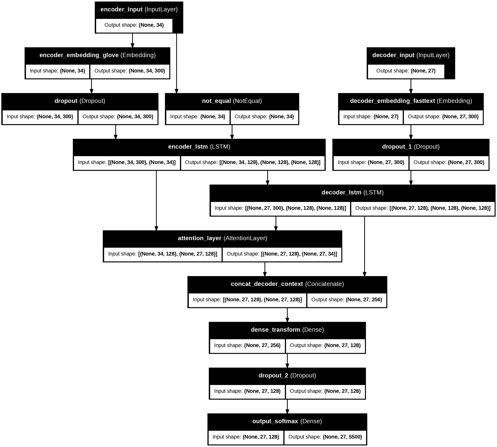

# English-Javanese Neural Machine Translation (NMT)

This project implements a Neural Machine Translation (NMT) model for translating English to Javanese. It uses a Sequence-to-Sequence (Seq2Seq) architecture with LSTMs and a Bahdanau-style Attention mechanism. The entire application is packaged into an interactive web app using Streamlit.



## Features

- **Interactive Translation**: A user-friendly interface to translate English sentences into Javanese in real-time.
- **Attention Visualization**: A heatmap that visualizes the model's attention weights, showing which English words the model focused on when generating each Javanese word.
- **Batch Evaluation**: Allows users to upload a CSV or TXT file to evaluate the model's performance on a larger dataset. It calculates BLEU scores (1-4) if ground truth translations are provided.
- **Translation History**: Keeps a log of the translations made during the session.
- **Detailed Token Information**: Shows the tokenization of both the input and output sentences.

## Model Architecture

The model is based on a Seq2Seq architecture:

- **Encoder**: An LSTM layer that processes the input English sentence and outputs a sequence of hidden states.
- **Attention Mechanism**: A Bahdanau Attention layer that allows the decoder to selectively focus on different parts of the input sentence for each step of the output generation.
- **Decoder**: An LSTM layer that generates the Javanese translation word by word, using the encoder's output and the context vector from the attention mechanism.

## How to Run

1.  **Clone the repository:**
    ```bash
    git clone <repository-url>
    cd <repository-directory>
    ```

2.  **Create and activate a virtual environment:**
    ```bash
    python -m venv venv
    .\venv\Scripts\activate 
    ```

3.  **Install the dependencies:**
    ```bash
    pip install -r requirements.txt
    ```

4.  **Run the Streamlit app:**
    ```bash
    streamlit run app.py
    ```

5.  Open your web browser and navigate to the local URL provided by Streamlit (usually `http://localhost:8501`).

## File Descriptions

- `app.py`: The main Streamlit application file.
- `requirements.txt`: A list of the Python dependencies required to run the project.
- `dataset/`: Contains the English (`.en`) and Javanese (`.jv`) parallel corpus used for training.
- `*.keras`: The trained Keras model files (encoder, decoder).
- `*.json`: Tokenizer and model configuration files.
- `*.pkl`: Serialized Python objects (e.g., tokenizers).
- `Final_Percobaan_Konfigurasi_04_glove_fasttext_attention_LSTM.ipynb`: The Jupyter Notebook containing the model training and experimentation process.
- `analisis_dataset.csv`, `bleu_scores_validation.png`, `training_history.png`, `training_log.csv`: Files related to model analysis and training results.
- `.gitignore`: Specifies which files and directories to ignore in the Git repository.

## Dependencies

- Streamlit
- TensorFlow
- Keras
- NumPy
- Pandas
- Matplotlib
- Seaborn
- NLTK
- Scikit-learn
- Regex
